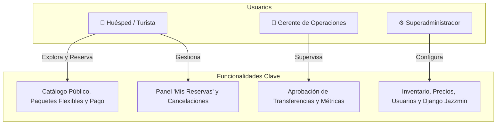
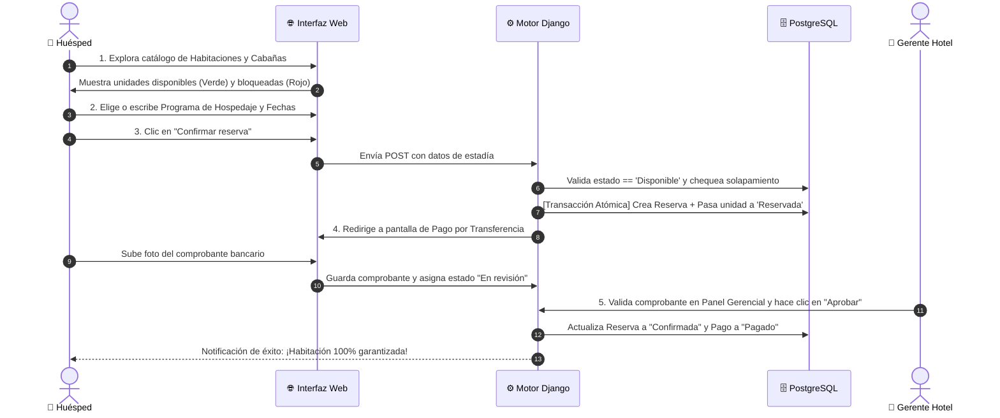

# 🌿 Sistema Hotelero Arahuana Eco-Resort & Spa 🌿

> **Plataforma Integral de Reservas, Experiencia Turística y Gestión Hotelera Inteligente**  
> *Transformando el descanso en la Amazonía ecuatoriana con tecnología moderna, segura y en tiempo real.*

[](https://www.python.org/)
[](https://www.djangoproject.com/)
[](https://www.postgresql.org/)
[](https://cloud.google.com/)
[](https://nginx.org/)
[](https://letsencrypt.org/)
[]()

---

## 📖 Documentación Rápida
- 📘 **Manual Técnico Exhaustivo:** Consulta [**MANUAL_DEL_SISTEMA.md**](MANUAL_DEL_SISTEMA.md) para detalles profundos de funciones, base de datos y comandos del servidor.
- 🌐 **Entorno en Vivo:** [hoteleroarahuana.duckdns.org](https://hoteleroarahuana.duckdns.org/)

---

## 🌟 1. El Problema y Nuestra Solución (Para Presentación / Exposición)

### ¿Cuál era la realidad de los hoteles antes de este sistema?
Imagina planificar las vacaciones de tus sueños en la selva amazónica, llegar después de 6 horas de viaje con tu familia... y que en recepción te digan:  
> *"Lo sentimos, esa habitación fue vendida dos veces porque anotamos la reserva por WhatsApp y no se actualizó la libreta."*

Este tipo de incidentes (sobreventa o *overbooking*, transferencias bancarias extraviadas, cotizaciones lentas) le cuestan a los hoteles miles de dólares y la pérdida de confianza de sus huéspedes.

### 💡 La Gran Solución: Ecosistema Arahuana
Diseñamos una **solución digital completa** que automatiza todo el proceso:
1. El cliente **explora** fotos reales, comodidades y precios transparentes.
2. Elige paquetes estándar (**2D1N, 3D2N, 4D3N**) o **escribe libremente su plan personalizado**.
3. **El sistema bloquea la habitación al instante** con una transacción atómica: ¡nadie más puede pisar su reserva!
4. Realiza el pago por transferencia bancaria, sube su comprobante y recibe su confirmación oficial.
5. El equipo del hotel administra todo desde un **Panel Gerencial en vivo**.

---

## 📊 2. Tabla Comparativa: Antes vs. Con el Sistema Arahuana

| Aspecto | ❌ Antes (Método Tradicional / Caos) | ✅ Con el Sistema Arahuana (Automatizado) |
|---|---|---|
| **Disponibilidad** | Llamadas telefónicas y libretas de papel. | **En tiempo real 24/7:** Insignia Verde (Disponible) o Roja (Reservada). |
| **Doble Reserva** | Alto riesgo de vender la misma habitación dos veces. | **Cero Overbooking:** Bloqueo automático e inmediato en base de datos. |
| **Programas de Hospedaje** | Tarifas rígidas o cálculos manuales con calculadora. | **Flexibilidad Total:** Menú desplegable + escritura libre de programas. |
| **Pagos y Cobros** | Comprobantes borrosos perdidos en chats de WhatsApp. | **Módulo de Transferencias:** Carga de foto y validación gerencial. |
| **Reservas no Pagadas** | Habitaciones congeladas por días que nadie paga. | **Autoliberación a las 24h:** Si no se paga, vuelve a estar disponible sola. |
| **Control Gerencial** | Cierres de caja en hojas de Excel desactualizadas. | **Dashboard en vivo:** Métricas de ocupación, ingresos y aprobaciones. |

---

## 🚀 3. Las 5 Grandes Joyas Tecnológicas del Proyecto

```text
 ┌────────────────────────────────────────────────────────────────────────┐
 │                      PILAR DE SEGURIDAD Y NEGOCIO                      │
 ├───────────────────┬───────────────────┬────────────────────────────────┤
 │ 🛡️ Anti-Duplicados│ ✍️ Planes Libres  │ ⏳ Autoliberación 24h          │
 │ Bloqueo atómico   │ Escribe o escoge  │ Cero habitaciones 'congeladas' │
 │ en base de datos  │ tu propio paquete │ si el cliente no paga a tiempo │
 ├───────────────────┴───────────────────┴────────────────────────────────┤
 │ 💳 Transferencias Auditadas       📊 Panel Gerencial en Tiempo Real    │
 │ Comprobante visual con revisión   Métricas instantáneas de ocupación   │
 └────────────────────────────────────────────────────────────────────────┘
```

### 1. 🛡️ Blindaje Anti-Doble Reserva (Zero Overbooking)
En cuanto un cliente confirma su solicitud, Django ejecuta una **transacción atómica** (`transaction.atomic()`):
- Comprueba que la habitación esté en estado `Disponible`.
- Valida que no exista ningún cruce de fechas en reservas previas.
- Cambia inmediatamente la habitación a estado **`Reservada`**.
- La tarjeta en la web muestra la insignia roja y el botón se desactiva:  
  `<button disabled><i class="fa-solid fa-circle-xmark"></i> No disponible</button>`

### 2. ✍️ Programas Flexibles (Fijos o Personalizados)
El huésped ya no está atrapado en un menú rígido:
- Puede hacer clic en las opciones predefinidas: **2 días / 1 noche**, **3 días / 2 noches**, **4 días / 3 noches**.
- O puede **escribir con su teclado** (ejemplo: *"5 noches familiares"* o *"Luna de miel 4 días"*).
- El motor del sistema interpreta el texto, calcula las noches exactas y genera la cotización justa al instante.

### 3. ⏳ Autoliberación Inteligente a las 24 Horas
¿Alguien reservó pero nunca envió el pago?
- El motor en segundo plano cancela automáticamente las reservas impagas al cumplirse las 24 horas.
- La habitación o cabaña vuelve a marcarse como **`Disponible` (Verde)** sin intervención humana, permitiendo que un cliente real sí pueda disfrutarla.

### 4. 💳 Pagos Transparentes con Comprobante Digital
- Evita el cobro de comisiones abusivas de pasarelas internacionales.
- El cliente transfiere directamente a la cuenta bancaria del hotel (Pichincha, Guayaquil, etc.) y sube una fotografía del comprobante.
- El estado pasa a `En revision` y queda archivado de forma segura y auditada.

### 5. 👥 Experiencia Multi-Rol
Diseñado para tres públicos claramente definidos:
1. **El Huésped:** Interfaz limpia, catálogo fotográfico inmersivo, reserva rápida y panel "Mis Reservas".
2. **El Gerente:** Pantalla ejecutiva para revisar ingresos, aprobar comprobantes y ver tasa de ocupación.
3. **El Administrador del Hotel:** Control total del inventario, altas/bajas de habitaciones y personalización de contenidos.

---

## 👥 4. Roles y Ecosistema de Usuarios



| Rol | ¿Qué puede hacer en la plataforma? | Interfaz de Acceso |
|---|---|---|
| **Huésped / Cliente** | Explorar catálogo, elegir programas, reservar unidades, subir comprobante bancario, cancelar reservas pendientes. | `/`, `/habitaciones/`, `/mis-reservas/` |
| **Gerente** | Verificar transferencias bancarias, aprobar o rechazar reservas, monitorear ocupación e ingresos en tiempo real. | `/gerente/` |
| **Superadministrador** | Gestionar inventario de habitaciones/cabañas, tarifas, usuarios del sistema y configuraciones globales. | `/admin/` (Jazzmin Suite) |

---

## 🗺️ 5. El Viaje del Huésped (Customer Journey Emocional)

> *De la curiosidad inicial al descanso absoluto en la selva: así vive la experiencia un huésped en Arahuana.*

```text
 ┌─────────────────┐       ┌─────────────────┐       ┌─────────────────┐       ┌─────────────────┐       ┌─────────────────┐
 │  1. EXPLORAR    │  ──►  │  2. PERSONALIZAR│  ──►  │  3. BLINDAR     │  ──►  │  4. PAGAR       │  ──►  │  5. ¡DISFRUTAR! │
 │  🌿 Catálogo    │       │  ✍️ Plan Libre   │       │  🛡️ Bloqueo BD  │       │  💳 Transfer    │       │  🌴 Selva Viva  │
 │  🟢 DISPONIBLE  │       │  📅 Fechas/Noches│       │  🔴 RESERVADA   │       │  📸 Comprobante │       │  ✅ CONFIRMADA  │
 └─────────────────┘       └─────────────────┘       └─────────────────┘       └─────────────────┘       └─────────────────┘
    🙂 Curiosidad             🤩 Entusiasmo              🔒 Tranquilidad            📱 Comodidad              🎉 Felicidad Total
```

---

### 🌟 Las 5 Etapas del Huésped Paso a Paso

#### 🌿 Etapa 1: El Descubrimiento (Catálogo Inmersivo)
- **Acción del Huésped:** Ingresa desde su celular o laptop a la web del hotel, admira fotografías reales en alta resolución de las habitaciones y cabañas, su capacidad y comodidades.
- **Lo que ve en pantalla:** 
  - 🟢 **Insignia Verde:** `Disponible` destacada con diseño natural.
  - 🔘 **Botón Activo:** `Reservar ahora`.
- **Sensación:** Curiosidad y confianza visual inmediata.

#### ✍️ Etapa 2: La Elección Flexible (Sin Ataduras)
- **Acción del Huésped:** Abre el modal de reserva. Puede elegir un paquete predefinido (**2 días / 1 noche**, **3D/2N**, **4D/3N**) o **escribir con su teclado** (ej. *"5 noches familiares"* o *"Luna de Miel 4 días"*).
- **Lo que hace el motor:** Interpreta el texto ingresado, extrae el número de noches y recalcula la cotización justa al instante en pantalla.
- **Sensación:** Libertad y control total de su presupuesto.

#### 🛡️ Etapa 3: El Blindaje Atómico (Cero Sobreventa)
- **Acción del Huésped:** Selecciona sus fechas y hace clic en **"Confirmar reserva"**.
- **Magia Tecnológica:** En menos de 50 milisegundos, Django ejecuta una **transacción atómica** (`transaction.atomic()`):
  - Verifica que la unidad siga disponible y que no haya cruce de fechas.
  - Genera el código único de reserva.
  - **Cambia la unidad inmediatamente a 🔴 `RESERVADA`**.
  - Si otro usuario en cualquier parte del mundo intenta reservar esa misma habitación, el sistema lo bloquea con el botón desactivado: `No disponible`.
- **Sensación:** Seguridad absoluta de que nadie le arrebatará su estancia.

#### 💳 Etapa 4: El Pago Cómodo y Transparente
- **Acción del Huésped:** Es redirigido a la pasarela interna. Copia los datos bancarios del hotel (Banco Pichincha, Guayaquil, etc.), realiza la transferencia desde su banca móvil y **sube una foto o captura del comprobante**.
- **Lo que hace el sistema:** Guarda la imagen protegida en el servidor, asocia la transferencia a la reserva y marca el estado como `En revision`.
- **Regla de Oro:** Se activa el temporizador inteligente de **24 horas**. Si el pago no se realiza a tiempo, el sistema libera la habitación automáticamente.
- **Sensación:** Cero fricción, sin necesidad de ingresar tarjetas de crédito internacionales ni pagar comisiones abusivas.

#### 🌴 Etapa 5: Confirmación Oficial y ¡A Disfrutar!
- **Acción del Gerente:** El equipo de recepción revisa la imagen del comprobante en su **Panel Gerencial** y con un solo clic presiona **"Aprobar Pago"**.
- **Resultado:** La reserva pasa a **`CONFIRMADA`**. El huésped puede consultarla en su panel de *"Mis Reservas"*. ¡Maletas listas para vivir la magia de la Amazonía!
- **Sensación:** Tranquilidad absoluta y emoción por viajar.

---

### 📊 Tabla Resumen: El Viaje del Huésped en Cifras y Pantallas

| Paso | Acción del Huésped | Magia Tecnológica Detrás | Estado Visual en Pantalla | Emoción del Usuario |
|:---:|---|---|:---:|:---:|
| **1** | Navega el catálogo de habitaciones/cabañas. | Carga optimizada de imágenes con fallback automático. | <span style="color:green">🟢 **DISPONIBLE**</span> | 🙂 Curiosidad y agrado |
| **2** | Elige o tipea su programa de hospedaje. | Algoritmo `resolver_programa_y_noches` en Python. | 📝 **Tarifa calculada al vuelo** | 🤩 Control y flexibilidad |
| **3** | Clic en *"Confirmar reserva"*. | Transacción atómica en PostgreSQL + chequeo de solapamiento. | <span style="color:red">🔴 **RESERVADA**</span> (Botón Bloqueado) | 🔒 Seguridad anti-robo |
| **4** | Transfiere y sube foto del comprobante. | Validación MIME multipart + reloj de autoliberación 24h. | 🟡 **PAGO EN REVISIÓN** | 📱 Facilidad y transparencia |
| **5** | Espera aprobación gerencial. | Cambio de estado instantáneo a confirmado en base de datos. | 🟢 **RESERVA CONFIRMADA** | 🎉 Felicidad y alivio |

---

### 🔄 Diagrama de Flujo Técnico (Secuencia)



---

## 🛠️ 6. Arquitectura Técnica y Stack Tecnológico

El proyecto sigue una arquitectura **MVT (Model-View-Template) desacoplada** con una capa de **Servicios de Dominio** para garantizar alta escalabilidad, orden y mantenibilidad.

```text
┌─────────────────────────────────────────────────────────────┐
│                    CAPA DE PRESENTACIÓN                     │
│    HTML5 Semántico · CSS3 Modular (Resort Theme) · JS ES6   │
└──────────────────────────────┬──────────────────────────────┘
                               │ Peticiones HTTP / Formularios
┌──────────────────────────────▼──────────────────────────────┐
│                    CAPA DE CONTROLADORES                    │
│   gestion_hotel/views/: catalog, reservations, payments,    │
│                         auth, client, gerente               │
└──────────────────────────────┬──────────────────────────────┘
                               │ Reglas de Negocio
┌──────────────────────────────▼──────────────────────────────┐
│                  CAPA DE SERVICIOS PURA                     │
│   gestion_hotel/services/reservations.py                    │
│   • Resolver programas    • Calcular precios de estadía     │
│   • Sincronizar estados   • Cancelar reservas vencidas      │
└──────────────────────────────┬──────────────────────────────┘
                               │ ORM de Django
┌──────────────────────────────▼──────────────────────────────┐
│                  CAPA DE DATOS (PERSISTENCIA)               │
│   PostgreSQL: Clientes, Habitaciones, Cabañas, Reservas     │
└─────────────────────────────────────────────────────────────┘
```

### ¿Por qué elegimos estas tecnologías?

| Tecnología | Rol en el Sistema | ¿Por qué es la mejor elección? |
|---|---|---|
| **Python 3.10+** | Lenguaje Principal | Código legible, robusto, seguro y estándar mundial en ingeniería de software. |
| **Django** | Framework Web | Arquitectura madura con seguridad integrada contra inyecciones SQL, CSRF y XSS. |
| **PostgreSQL** | Base de Datos Relacional | Garantiza consistencia total (ACID) y transacciones atómicas para reservas hoteleras. |
| **Django Jazzmin** | Panel de Control | Interfaz administrativa elegante, intuitiva y personalizable para los operadores. |
| **Nginx** | Reverse Proxy en Producción | Manejo eficiente de conexiones simultáneas, compresión Gzip y terminación SSL. |
| **Gunicorn** | Servidor WSGI | Puente de alto rendimiento entre el servidor web Nginx y el código Python. |
| **Google Cloud** | Infraestructura en la Nube | Máxima disponibilidad, escalabilidad y respaldo empresarial 24/7. |

---

## 📂 7. Mapa del Código: ¿Qué hace cada carpeta?

```text
Hotel-A/
├── arahuana_resort/           # Ajustes globales de Django (settings, urls, wsgi)
├── gestion_hotel/             # Aplicación principal del hotel
│   ├── models.py              # Definición de las tablas maestras y relaciones
│   ├── forms.py               # Formularios validados (registro, login, perfiles)
│   ├── validators.py          # Validaciones estrictas de cédula/RUC y contraseñas
│   ├── middleware.py          # Control de accesos y redirecciones por rol
│   ├── services/              # LÓGICA DE NEGOCIO (cálculos, fechas, sincronización)
│   ├── views/                 # CONTROLADORES (catálogo, pagos, reservas, gerente)
│   ├── templates/             # Plantillas HTML estructuradas por módulos
│   └── static/                # Hojas de estilo CSS modulares, scripts e imágenes
├── media/                     # Fotografías reales subidas y comprobantes bancarios
├── staticfiles/               # Directorio optimizado para distribución web con Nginx
├── MANUAL_DEL_SISTEMA.md      # Manual técnico exhaustivo para desarrolladores
└── README.md                  # Este documento de presentación y guía general
```

---

## 🌐 8. Infraestructura y Despliegue en la Nube

El sistema se encuentra desplegado y funcionando en vivo en **Google Cloud Platform**:

```text
               INTERNET (Usuarios y Turistas)
                             │
                             ▼ [HTTPS / Puerto 443]
               ┌──────────────────────────────┐
               │    NGINX (Reverse Proxy)     │
               │ Let's Encrypt SSL Certificado│
               └──────────────┬───────────────┘
                              │ Proxy Pass (127.0.0.1:8001)
                              ▼
               ┌──────────────────────────────┐
               │    GUNICORN (hotel.service)  │
               │   Servidor de Aplicaciones   │
               └──────────────┬───────────────┘
                              │ Django ORM
                              ▼
               ┌──────────────────────────────┐
               │    POSTGRESQL DATABASE       │
               │   delivery-109f4 (Cloud VM)  │
               └──────────────────────────────┘
```

- **Servidor:** Instancia `free-ubuntu-vm` en Google Cloud Compute Engine (Zona `us-central1-a`).
- **Dominio Público:** [https://hoteleroarahuana.duckdns.org](https://hoteleroarahuana.duckdns.org)
- **Seguridad:** Tráfico 100% cifrado con HTTPS vía Let's Encrypt con renovación automática.

---

## 💻 9. Instalación y Ejecución Local

Si deseas correr este proyecto en tu propia computadora:

### 1. Clonar el repositorio
```bash
git clone https://github.com/BETACRD01/Hotel-A.git
cd Hotel-A
```

### 2. Crear y activar entorno virtual
```bash
# En macOS / Linux:
python3 -m venv venv
source venv/bin/activate

# En Windows (PowerShell):
python -m venv venv
.\venv\Scripts\Activate.ps1
```

### 3. Instalar dependencias
```bash
pip install -r requirements.txt
```

### 4. Configurar variables de entorno
Crea el archivo `.env` tomando como base `.env.example`:
```bash
cp .env.example .env
```
Configura los accesos a tu base de datos PostgreSQL local y claves secretas.

### 5. Aplicar migraciones e iniciar servidor
```bash
python manage.py migrate
python manage.py createsuperuser
python manage.py runserver
```

Abre tu navegador en: **`http://127.0.0.1:8000/`**

---

## 🎯 10. Conclusión y Valor del Proyecto (Pitch de Cierre)

El **Sistema Hotelero Arahuana Eco-Resort & Spa** no es solo un software de reservas: es una herramienta de **transformación digital integral**. 

Logra conjugar:
- **La tranquilidad del huésped:** que reserva sabiendo que su habitación está 100% garantizada y con tarifas transparentes.
- **La eficiencia del hotel:** que elimina los errores manuales, automatiza cobros por transferencia y administra todo desde un tablero moderno.
- **La robustez de la ingeniería de software:** con transacciones atómicas, código modular limpio y arquitectura en la nube de alta disponibilidad.

---

> *Desarrollado con dedicación y excelencia técnica para llevar el turismo ecuatoriano al siguiente nivel digital.* 🌿🇪🇨
